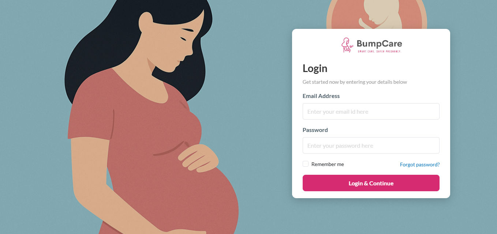
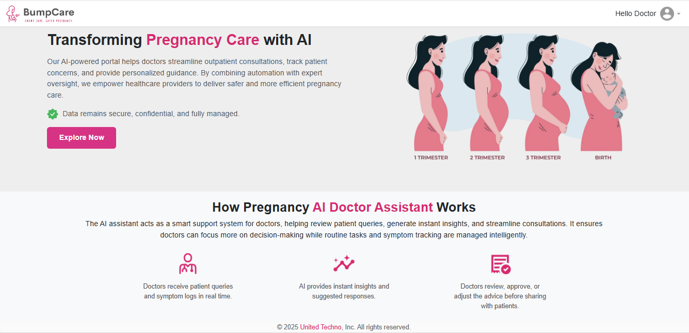
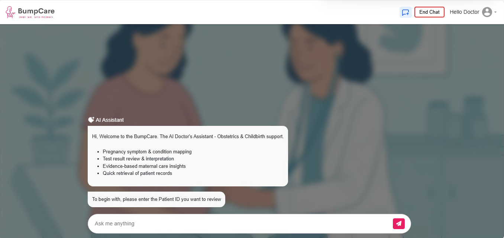
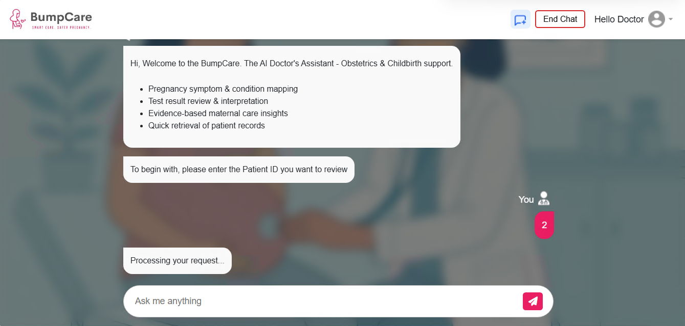
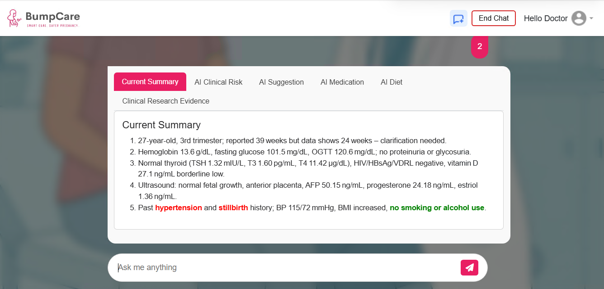
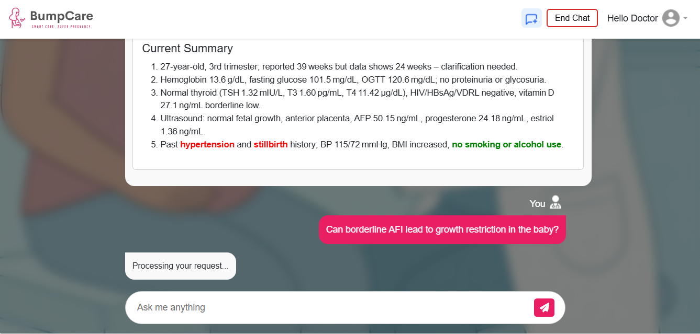
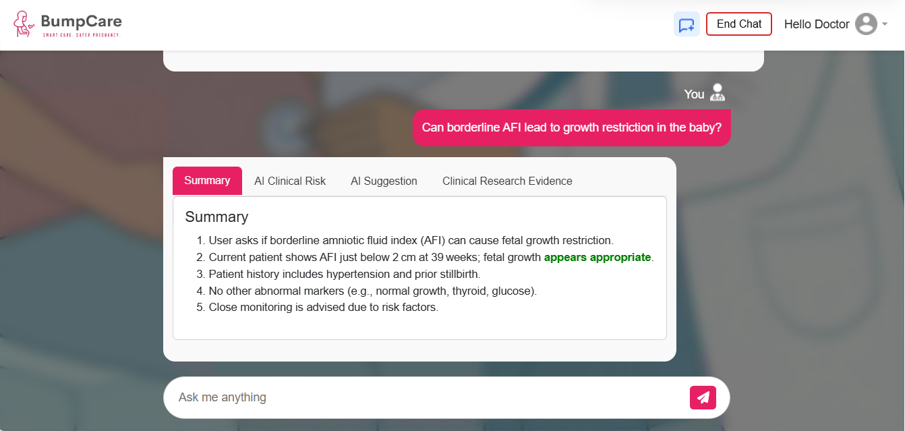

# 🤰 BumpCare AI – Smart Care, Smart Pregnancy


**BumpCare AI** is an **AI-powered pregnancy care assistant** built for **doctors and nurses**.  
It provides instant trimester summaries, risk identification, medication class suggestions, and evidence-based recommendations by leveraging **gpt-oss-20b**.  

Developed by **[United Techno](https://www.unitedtechno.com/)**.  

---

## 📚 Table of Contents
- [Problem Statement](#-problem-statement)
- [Solution](#-solution--bumpcare-ai)
- [Key Aspects of the Solution](#-key-aspects-of-the-solution)
- [Application Screenshots](#-application-screenshots)
- [System Architecture](#-system-architecture)
- [Data Flow](#-data-flow)
- [RAG & Model Details](#-rag--model-details)
- [Data Model](#-data-model)
- [Security & Compliance](#-security--compliance)
- [Ethical Considerations](#-ethical-considerations)
- [Setup Instructions](#-setup-instructions)
- [Future Roadmap](#-future-roadmap)
- [Known Limitations](#-known-limitations)
- [Submission Video](#-submission-video)
- [Team](#-team)
- [Tagline](#-tagline)
- [License](#-license)

---

## 🚩 Problem Statement

Pregnancy care is one of the **most critical and high-risk** areas in healthcare. Doctors and nurses face daily challenges during outpatient consultations:

- **High Patient Volume & Time Pressure**  
- **Fragmented Data Across Reports**  
- **Missed Risk Detection**  
- **Cognitive Overload for Doctors**  
- **Lack of Real-time Evidence Support**  

➡️ These gaps directly affect **maternal safety, fetal development, and quality of care**.  

---

## 💡 Solution – BumpCare AI

BumpCare AI is designed to bridge these gaps by acting as a **doctor’s daily AI assistant**. Using patient IDs linked to hospital records, the system automatically generates trimester summaries, risk predictions, and safe recommendations.  

---

## ✨ Key Aspects of the Solution

- **Automated Patient Summaries**  
  Provides trimester status, vitals, lab test interpretations, and fetal growth details. Consolidates fragmented records into a single, structured view.  

- **Risk Detection & Alerts**  
  AI flags early signs of pre-eclampsia, gestational diabetes, fetal growth restriction, thyroid disorders, and anemia. Trend-based alerts highlight worsening conditions (e.g., rising BP, falling Hb).  

- **AI-Generated Recommendations**  
  Suggests generic medication classes (iron, folic acid, calcium, omega-3, levothyroxine). Provides food & nutrition guidance, safe trimester exercises, and lifestyle precautions. Outputs are textual, clear, and doctor-friendly.  

- **Case Similarity Analysis**  
  Compares current patients with past cases stored in the database. Offers insights on how similar cases were monitored and managed.  

- **Evidence-Based Medicine**  
  Retrieves and links to research papers and medical ontology. Ensures all AI suggestions are backed by trusted medical sources.  

- **Doctor Workflow Support**  
  Doctors save time by reviewing AI summaries instead of raw reports. Nurses receive guidance on nutrition, exercise, and lifestyle recommendations.  

- **Nutrition & Exercise Guidance**  
  Trimester-specific recommendations include iron-rich foods, calcium and folate support, and safe physical activities such as light yoga, walking, and stretching. Advice on hydration, sleep hygiene, and avoiding restricted foods/activities.  

---

## 🖥️ Application Screenshots / Testing Instructions

- Login Page



- Doctor Portal



- AI Assistant Chat



- AI Assistant Chat - Patiend ID Input



- AI Assistant Chat - Patiend ID Response



- AI Assistant Chat - Specific Questions based on Patient ID



- AI Assistant Chat - Response from Specific Question



---

## 🏗️ System Architecture

1. **High-Level Overview** 


2. **Components**  

| Component   | Tech         | Responsibilities |
|-------------|-------------|------------------|
| Frontend    | HTML/CSS/JS | Login, Patient ID input, textual AI outputs |
| Backend     | Flask       | DBAuth, patient record aggregation, orchestrates AI |
| AI Models   | Ollama gpt-oss-20b | Summaries, risk reasoning, safe recs, citations |
| Patient DB  | SQL         | Stores patient visits, labs, history |
| Vector Store| FAISS       | Research, ontology, similar cases |
| Security    | DB-Based Auth | Role-based access | 

---

## 📊 RAG & Model Details

- **Embeddings**: `all-MiniLM-L6-v2`  
- **Precomputed embeddings** stored in FAISS for efficient similarity search.  
- **Models**: `gpt-oss-20b` for fast responses.  
- **Safety Guards**: no branded drugs, value-range validation, unsafe meds filter.  
- **RAG Data Sources**: Peer-reviewed articles and guidelines including:  
  - *Maternal Diet and Nutrient Requirements in Pregnancy*  
  - *Daily Iron and Folic Acid Supplementation in Pregnant Women*  
  - *Dietary Supplements and Life Stages: Pregnancy*  
  - *Maternal and Child Nutrition*  

These sources enhance retrieval accuracy, evidence-backed insights, and ensure continuous updates.  

---

## 🗄️ Data Model

Note: Patient data is **synthesized** for privacy.  

Examples:  

```
Patient_data_trimester1 (PatientID, Trimester, Month, Week, Beta_hCG, Hemoglobin, BloodGroup, RhFactor, BloodSugar_Fasting, BloodSugar_PostMeal, OGTT, AFP, Triple_Test, Progesterone, Estriol, Platelet_Count, Abortion_Status, etc.)

Patient_data_trimester2 (PatientID, Age, Region, PastMedicalConditions, Gravida, Para, Abortions, PreviousPregnancyComplications, etc.)

Patient_data_trimester3 (PatientID, Age, Region, PastMedicalConditions, Gravida, Para, Abortions, PreviousPregnancyComplications, etc.)
```

---

## 🔐 Security & Compliance

- **DB-Auth** for access control.  
- **Privacy-first**: Synthesized patient data prepared for demos and testing.  

---

## ⚖️ Ethical Considerations

- **Doctor-in-the-loop** → AI supports, doctors decide.  
- **Non-branded recommendations** → Only generic medication classes.  
- **Transparency** → All AI outputs link to evidence/research.  
- **Privacy** → Patient data anonymized and securely handled.  

---

## ⚙️ Setup Instructions

```bash
# Clone repo
git clone https://github.com/unitedtechno/bumpcare-ai.git
cd bumpcare-ai

# Install dependencies
pip install -r requirements.txt

# Run backend
python app.py
```

Access at: [http://127.0.0.1:5000](http://127.0.0.1:5000)  
Test with sample patient IDs from [`/Sample_Data.json`](./Sample_Data.json)  

---

## 🛠️ Future Roadmap

- **Integration with multiple hospitals** → Expand deployment to connect with a network of hospitals.  
- **EHR/EMR Sync** → Support bidirectional sync with hospital EHR/EMR systems so patient summaries, risks, and AI suggestions are automatically stored in official records.  
- **Interoperability Standards** → Adopt HL7 FHIR / SNOMED CT to ensure data portability across healthcare systems.  
- **Postpartum Care** → Extend BumpCare beyond pregnancy into postpartum mother and infant health.  
- **Wearable Integration** → Ingest real-time vitals (BP cuffs, glucose monitors, smartwatches) for continuous risk monitoring.  
- **Multilingual Support** → Enable region-specific languages to support rural doctors and patients.  
- **Mobile Companion App** → Lightweight mobile tool for nurses and field healthcare workers.  

---

## ⚠️ Known Limitations

- **Doctor-in-the-loop required** → BumpCare AI is a decision-support tool, not a replacement for clinical judgment. All outputs must be validated by a healthcare professional.  
- **Research freshness** → Recommendations depend on how frequently medical guidelines and research papers are ingested into the vector store. Delays may reduce evidence currency.  
- **Data dependency** → The system’s accuracy relies on completeness and quality of patient records (labs, scans, vitals). Missing data may affect risk assessment.  
- **EHR/EMR integration scope** → Current implementation is hospital-specific. Cross-hospital interoperability (FHIR/HL7) is part of the future roadmap, not fully implemented yet.  
- **Language limitations** → Presently supports English only; multilingual expansion is planned.  
- **Edge cases in pregnancy** → Rare complications (e.g., multiple gestation anomalies, rare genetic syndromes) may not be covered fully by the AI assistant.  

---

## 🎥 Submission Video

Demo video (≤ 3 minutes) showcasing:  
- **Doctor login**  
- **Patient ID entry**  
- **AI-generated summary & risk detection**  
- **Recommendations** (medications, food, exercise)  
- **Research link outputs**
   
[](https://www.youtube.com/watch?v=e0Bsm3chnuQ)
---

## 👩‍💻 Team – United Techno (AI & Healthcare Innovation)

- **Ramesh Hariharan**  
- **Vigneshwaran Neelakandan**  
- **Gayathri Gunasekar**  

🔗 [United Techno Website](https://www.unitedtechno.com/)  

---

## ✨ Tagline

**BumpCare AI = Faster Reviews. Smarter Care. Safer Pregnancy.**  

---

## 📜 License

This project is licensed under the **Apache License 2.0** – see the [LICENSE](https://www.apache.org/licenses/LICENSE-2.0.txt) file for details.
